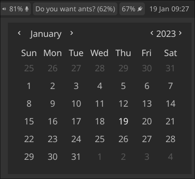

# eww_widgets
Collection of basic Eww widgets that would be best used in a bar. These are intended to be used for getting up and running with [Eww](https://github.com/elkowar/eww), before customising further yourself (see inspiration section below). Many of these widgets have similar functionality of their equivalent waybar module.

For ease of getting up and running, all of these are themed using the low number colours in base16. See [eww.scss](eww.scss) for details on obtaining other themes.

Each of the modules can be used by copy/pasting the yuck/scss code into your main file or including the files. And example bar is included in [eww.yuck](eww.yuck). Remember to update the location of scripts if you are not using the default `~/.config/eww/scripts/` directory.

Included widgets:

* Backlight
* Battery
* Clock/Calendar
* CPU
* Idle Inhibitor
* Music
* Network
* RAM
* Volume

Inspiration taken from:
* [Eww examples](https://github.com/elkowar/eww/tree/master/examples/eww-bar)
* [adishourya's dotfiles](https://github.com/adishourya/wayland_dotfiles)
* [saimoonedits eww-widgets](https://github.com/saimoomedits/eww-widgets)